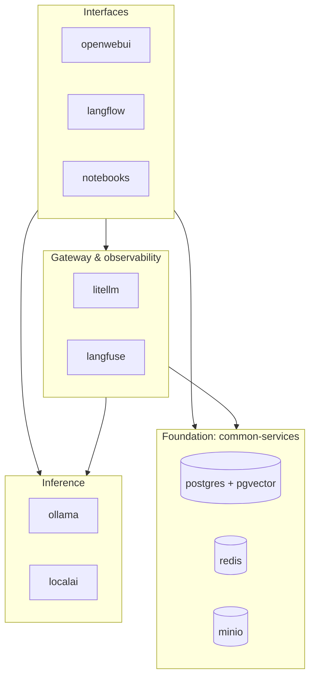
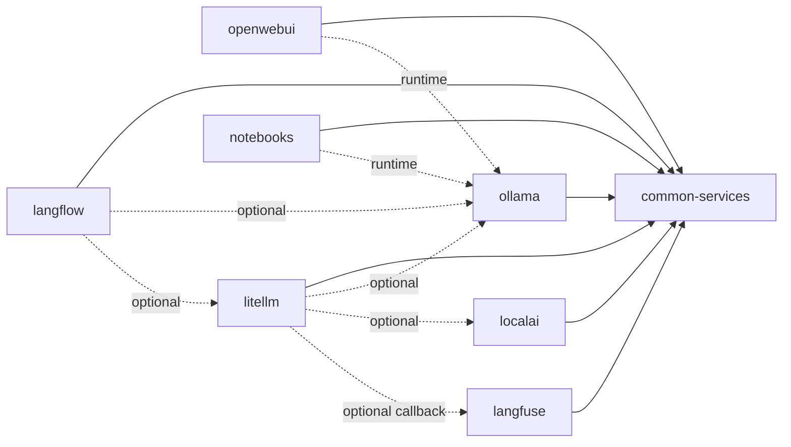

# Architecture

How llm-lab is put together: the network, module dependencies, data flows, storage and design decisions.

## Overview

llm-lab is a set of **independent Docker Compose projects** (one per folder in `modules/`) that share **one Docker network** (`lang`) and **one data layer** (`common-services`). The root `Makefile` runs `docker compose` in each module folder.

| Layer | Modules | Responsibility |
|---|---|---|
| Foundation | `common-services` | Creates the network. Provides database, cache/queues and object storage. |
| Inference | `ollama`, `localai` | Load models and serve completions and embeddings over HTTP. |
| Gateway & observability | `litellm`, `langfuse` | One API in front of many backends; traces, prompts and evals. |
| Interfaces | `openwebui`, `langflow`, `notebooks` | Chat, visual flows and code experiments. |

Lower layers never depend on higher ones. A module may skip layers.

## Network

- The network is named `lang`. It is **created** by `common-services` and **referenced as external** by every other module.
- Docker DNS resolves container names, so containers talk by name (`ollama`, `postgres`, `redis`, `minio`, `litellm`, `langfuse-web`, …) on the container's own port.
- From the host, use `localhost` and the published port. Inside a container, `localhost` means that container itself, a common mistake in Langflow and notebook configs.

## Dependencies and start order

Solid arrows are hard dependencies (the module fails to start without them). Dotted arrows are runtime: the module starts, but features fail until the target is up.

Compose `depends_on` only works inside a project. Order across modules comes from the `Makefile`: every module target depends on `common-services`, which also creates the databases.

## Main flows

**Chat.** The browser talks to Open WebUI, which calls Ollama. Open WebUI keeps its own state in its own volume.

**Gateway with tracing.** A client calls LiteLLM with an API key. LiteLLM checks keys and config in Postgres, forwards to Ollama, LocalAI or another provider, returns an OpenAI-format response, and optionally reports the trace to Langfuse. Prometheus scrapes LiteLLM metrics.

**Langfuse ingestion.** SDKs or OTLP send events to `langfuse-web`, which stores raw events in MinIO and queues them in Redis. `langfuse-worker` processes them into ClickHouse. Users, projects and prompts live in Postgres.

**RAG.** Documents are split, embedded with an Ollama embedding model and stored in a vector store (in-memory in the example notebook, or pgvector in Postgres). A query is embedded, matched, and the context plus question goes to the LLM.

## Storage

| Data | Where |
|---|---|
| Postgres databases | `common-services` named volume, mounted at `PGDATA` |
| Redis, MinIO objects | `common-services` named volumes |
| Ollama models | `ollama` named volume |
| LocalAI models and backends | bind mounts in `modules/localai` (git-ignored) |
| Open WebUI data | `openwebui` named volume |
| Langflow flows | Postgres; extra state in a named volume |
| Notebooks | bind mount in `modules/notebooks` |
| Prometheus data | `litellm` named volume |
| ClickHouse data | `langfuse` named volumes |

Named volumes are prefixed with the Compose project (folder) name. They survive `docker compose down`; only `down -v` removes them.

**Databases:** `langflow`, `langfuse` and `litellm` (listed in `POSTGRES_DATABASES`) are created, with `vector`, by `scripts/create_databases.sh` whenever `make common-services` runs. It is idempotent.

## Ports

Every host port is a `*_PORT` variable in the module's `.env`. Check what is already taken before adding a module. Change only the **host** side of a mapping; container ports and in-network addresses stay the same, so other modules are unaffected. Admin-only ports should bind to `127.0.0.1`. ClickHouse has no host port on purpose.

## GPU

`ollama`, `localai` and `openwebui` run on CPU by default. Their `docker-compose.gpu.yml` override reserves NVIDIA GPUs, and the Makefile adds it when the NVIDIA runtime is detected. They share the GPU but compete for VRAM; on small GPUs run one inference server at a time. See [CONFIGURATIONS.md](CONFIGURATIONS.md).

## Design decisions

| Decision | Why | Trade-off |
|---|---|---|
| One Compose project per module | Start, upgrade or delete a technology independently | Cross-module order is handled by the Makefile |
| One external network | Every module reaches every other by name | No isolation; fine for a lab |
| Shared Postgres, Redis, MinIO | Less RAM, one place to back up | Shared credentials; modules can collide (database names, Redis keys) |
| pgvector Postgres image | Vector search for RAG without another service | Pinned to one major version |
| `example.env` + generated `.env` | Secrets stay out of git; `make create-envs` is idempotent | Keep templates in sync when adding variables |
| Custom images only where needed | Add packages without forking upstream | Rebuild is manual (`--build`) |

## Known issues

| Issue | Impact | Fix |
|---|---|---|
| MinIO uses the `latest` tag | Rebuilds can bring breaking changes | Chainguard publishes no other tag for the free tier; pin a digest if needed |
| Jupyter base image uses a floating `python-3.11` tag | Rebuilds can change packages | Pin a dated tag |
| Postgres volume changed from an anonymous volume to the `postgres` named volume | A lab created before this change starts with empty databases | `pg_dumpall` from the old container before recreating it |
